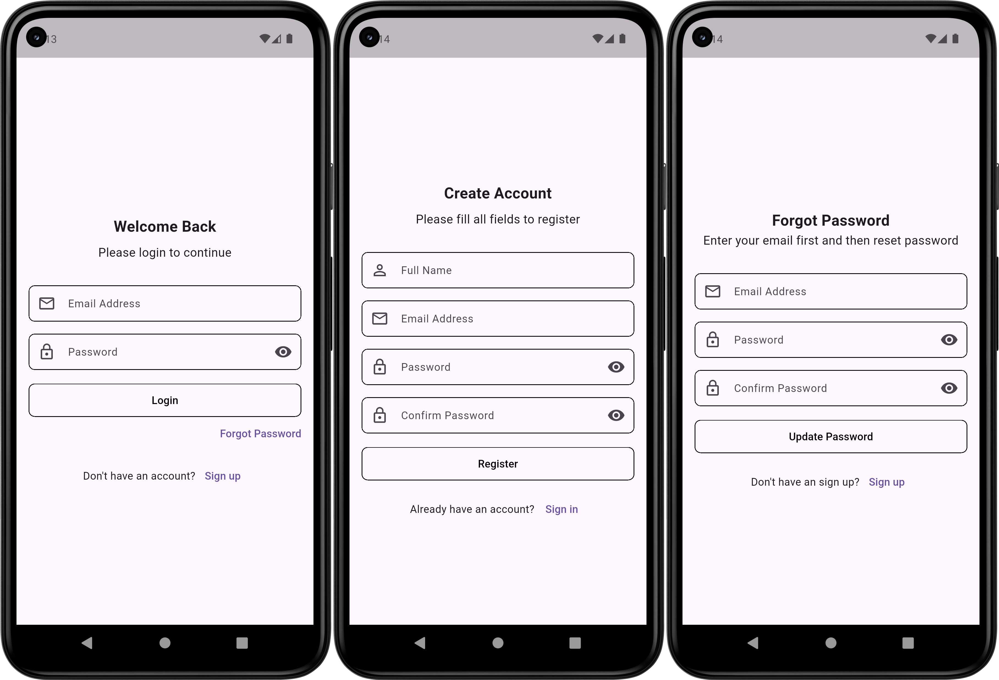
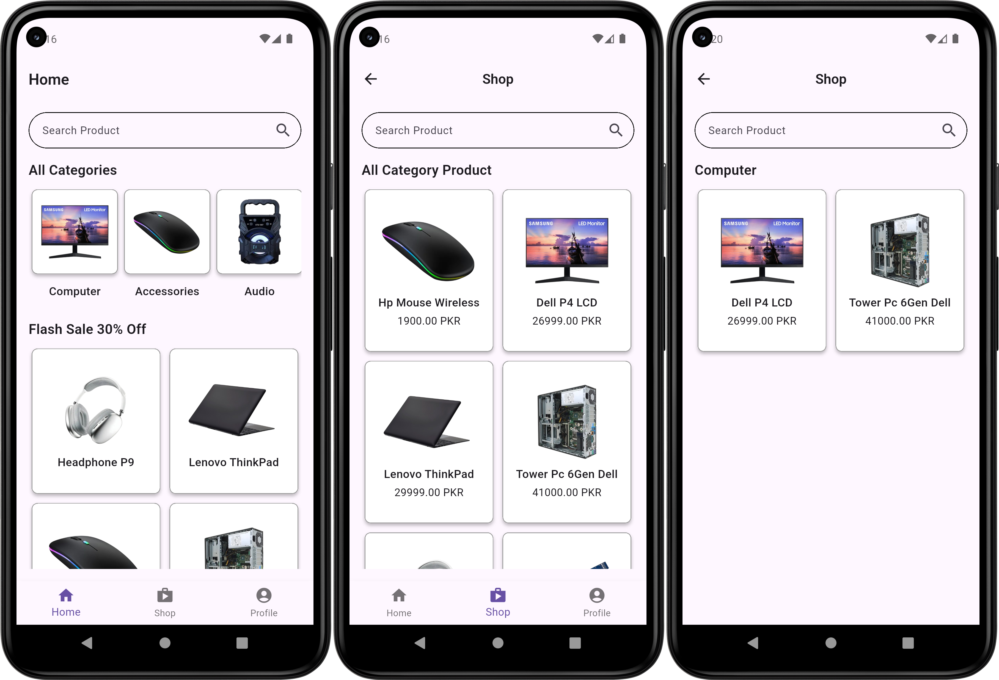
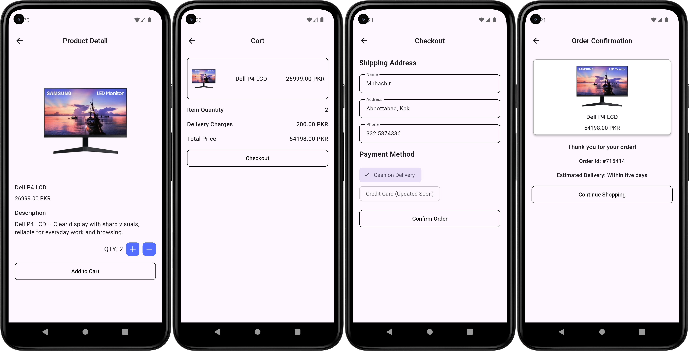
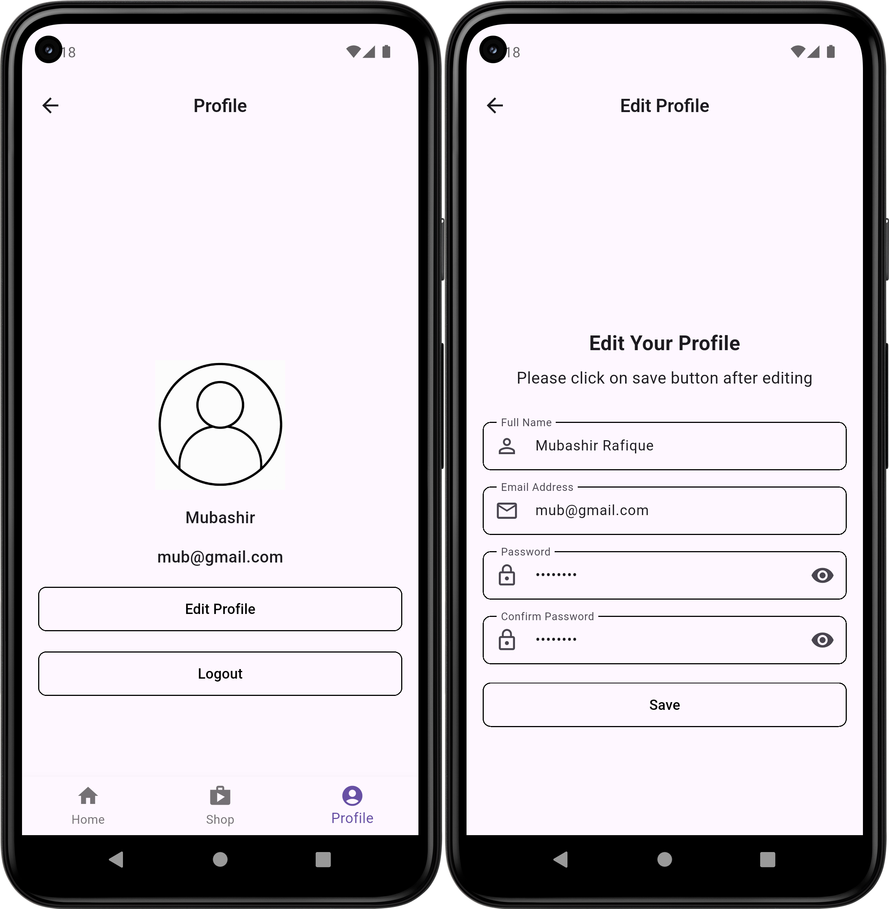

# Technest

A practice e-commerce app UI built in Flutter to demonstrate my skills in creating
clean, interactive, and user-friendly mobile interfaces. This app is designed for selling computers
and accessories such as RAM, mice, keyboards, and other peripherals. It features multiple screens and
components to simulate a complete shopping experience, including viewing product details, managing a
cart, placing orders, and managing user profiles.

## Content

- [Features](#features)
- [Technology Stack](#technology-stack--tools-used)
- [Purpose](#purpose)

## Features

### Authentication Screens

Screens for Login, Registration, and Password Reset. They feature clean UI, interactive form fields,
password visibility toggles, loading indicators, and smooth navigation between
authentication-related screens.

### Home & Shop Screens

These screens allow users to view all categories, see featured products, and browse items by
category. They include a search field, horizontal scroll for categories, and a grid layout for
products. Users can tap on any product to navigate to the Product Detail Screen.

### Order & Checkout Screens

These screens handle product details, cart management, and order placement. Users can view product
information, adjust quantities, proceed to checkout by entering shipping details, and confirm their
orders. The flow includes total price calculation, delivery charges, and order confirmation with a
unique order ID.

### Profile Screens

These screens allow users to view and manage their profile information. The Profile screen displays
the user’s name, email, and profile picture, with options to edit profile details or logout. The
Edit Profile screen enables updating full name, email, and password with password visibility toggle
and a save action.

## Technology Stack & Tools Used

- **Frontend:** Flutter
- **Programming Language:** Dart
- **State Management:** setState (Basic Flutter state management)
- **UI Components:** 
  - AppCard
  - AppContainer
  - AppIconButton
  - AppLoadingIndicator
  - AppOutlinedButton
  - AppText
  - AppTextField
- **IDE:** Android Studio & VS Code

## Purpose

I built this app to practice Flutter and improve my skills by working on a real project.

